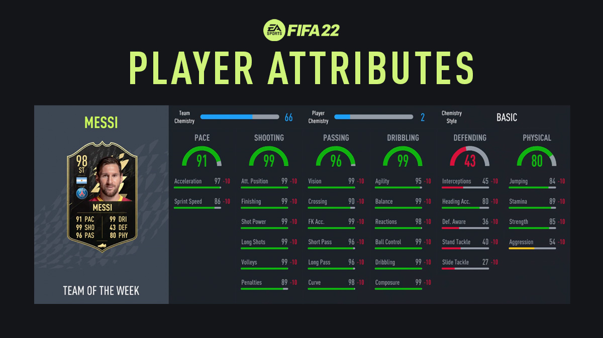
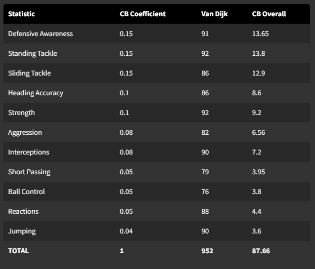

```{r setup, include=FALSE}
library(knitr)

knitr::opts_chunk$set(echo = TRUE, message = FALSE,
                      warning = FALSE)
knitr::opts_chunk$set(out.height = "\\textheight",  out.width = "\\textwidth")
```


# Introduction

The main goal of this project is to accurately predict the in game FIFA-ratings for players using Machine Learning Methods.

### What is Fifa and Why Might This Model be Useful?

[FIFA](https://en.wikipedia.org/wiki/FIFA_(video_game_series)) is an annually released sports video-game series developed by EA Sports. Given that European Football/Soccer is a sport enjoyed globally, it is no surprise that the FIFA series is the best selling video game franchise of all time with 325 million+ sales as of 2021. Over the years the game has evolved immensely, aiming to be as realistic as possible for football lovers to enjoy. In the latest release, [FIFA 22](https://www.ea.com/games/fifa/fifa-22), The game features 700+ teams, 17000+ players, 100 iconic digitally recreated stadiums, and 30+ fully licensed leagues to make the experience as true-to-life for players. 

The main focus of this project is related to a gamemode in FIFA called Ultimate team, where players are able to create their own Football Club, and build their own teams using player cards from their favorite players to play opponents online and try to take their team from division 10(lowest) to division 1(highest).

<table><tr>
<td>  </td>
<td>  </td>
</tr></table>
<p align="center">
<em> On the left is an example of Division Progression, and on the right is an example breakdown for a player card based on different attributes of that player. </em>
</p> 

Player cards can be obtained by opening packs or through the in-game marketplace, where cards can be bought or sold for coins (higher rated players will usually cost more). There are also regularly released player-cards to reflect players who are in-form(playing well / on their game), as well as tournament specific cards for whenever there is a major international event such as the World Cup, Euros, or Copa America. 

<table><tr>
<td>  </td>
<td>  </td>
</tr></table>
<p align="center">
<em> On the left is an example of player packs that are available to buy, and on the right is an example of special in-form player cards. They are colored differently and are higher rated than the base card for that player. </em>
</p> 

All this to say, players often strive to get better rated cards for their team in order to have a better team to play with in their road to division 1. My goal with this project is to use player attributes (i.e. age, height, weight, shooting, dribbling, passing, etc) in an attempt to predict their overall player rating (number on the top left of the card). A secondary goal of this is to also determine what attributes, if any, are most relevant for determining a player's rating.  

# Loading Data and Packages

### Packages / Libraries Being Used

```{r message = FALSE, warning=FALSE}
library(tidymodels) #tidymodels / tidyverse for model building and standardized code workflow
library(tidyverse)
library(janitor) # for clean names
library(ggplot2) # for EDA / General plotting
library(corrplot) # for correlation plot
library(glmnet) # ridge / lasso regression
library(vip) # visualize variable importance
library(randomForest) # Random Forest
library(xgboost) # boosted trees
library(kernlab) # support vector machines
library(DT) # data formatting 
tidymodels_prefer()
```

### The Raw Data

This is a table of the first 6 entries of the raw dataset of FIFA players' ratings imported from [Kaggle](https://www.kaggle.com/datasets/rishidamarla/fifa-players-ratings?select=fifa_cleaned.csv).

```{r echo=FALSE}
fifa_raw <- read_csv("data/fifa.csv")

datatable(fifa_raw %>% head(), extensions = 'FixedColumns',
  options = list(
    scrollX = TRUE,
    fixedColumns = TRUE))
```


With close to 18000 players and 92 different attributes for each, there is an incredible amount of data to work with. While the data is mostly clean and formatted for Machine Learning, there are some additional pre-processing steps that need to happen to make sure models are running smoothly.  

```{r, echo=FALSE}
dim(fifa_raw)
```

# Data Cleaning

Firstly, I used the clean_names() function from the *janitor* package in order to make sure all variable names used a consistent naming structure. For example, "Skill Moves(1-5)" was renamed to "skill_moves_1_5". 

```{r eval=FALSE}
fifa <- fifa %>% clean_names()
```

Then, I went through feature selection, deciding which features were relevant and which should be excluded.

- dropped variables that represented redundant (EX: dropped birthday and kept age)

- dropped positional variables that were just unnecessary noise

- dropped missing values, as well as variables that had significant missing values (EX: release clause (euros))

- dropped psuedo-response variables (EX: potential), which seemed to be a rating of a player at their peak, as it could easily provide a framework to guess a player's base rating. 

A more expansive list of predictors can be found in the codebook for this project. 

```{r eval=FALSE}
keeps <- c("overall_rating", "club_team", "club_position", "age", "height_cm", "weight_kgs","wage_euro", "nationality",
           "preferred_foot", "international_reputation_1_5", "weak_foot_1_5", "skill_moves_1_5", "work_rate", "crossing", "finishing",
           "heading_accuracy", "short_passing", "volleys", "dribbling", "curve", "freekick_accuracy", "long_passing","ball_control",
           "acceleration", "sprint_speed", "agility", "reactions", "balance", "shot_power", "jumping", "stamina", "strength", "long_shots",
           "aggression", "interceptions", "positioning", "vision", "penalties","composure", "marking", "standing_tackle",
           "sliding_tackle", "gk_diving", "gk_handling", "gk_kicking", "gk_positioning", "gk_reflexes") 
fifa <- fifa[, keeps]

fifa <- drop_na(fifa)
```

Although I had the predictors I wanted, I still needed to pre-process some variables like club_team and nationality. Because football is a global sport, there are players from all over the world, some of which are in unique scenarios. For instance, there were a number of players who didn't actually play for a specific club, but they played internationally. Another issue was with who were from nations with smaller representation in the bigger picture of football, as they weren't being properly represented in training and testing sets. These issues led to problems with factor levels when running models, so I chose to drop certain players that fit these edge cases, as imputing the values and/or correcting the information would be near impossible. 

```{r eval=FALSE}
exclusions <- c('Andorra', 'Yemen', 'Nicaragua', 'South Sudan', 'Malta', 'Eritrea', 'Liberia',
                'St Lucia', 'United Arab Emirates', 'Guam', 'Indonesia', 'New Grenada','Fiji',
                'Barbados','Guatemala', 'Faroe Islands', 'Korea DPR','Kuwait','Tanzania',
                'Hong Kong','St Kitts Nevis','Tanzania', "Côte d'Ivoire", 'Oman', 'Chad',
                "São Tomé & Príncipe", "Rwanda", "Papua New Guinea", "Latvia", "Vietnam",
                'Azerbaijan', 'Ethiopia', 'Jordan', "New Caledonia", "Dominican Republic",
                "Liechtenstein", 'Montserrat', "Afghanistan", "Uzbekistan", "Palestine",
                "Suriname","Comoros", "Grenada", "Libya", "Thailand", "Philippines",
                "Antigua & Barbuda", "Central African Rep.", "Cuba", "Guyana")

fifa <- fifa[-which(fifa$nationality %in% exclusions), ] #17598 rows

fifa <- fifa[-which(fifa$club_team %in% exclusions), ] #17597 rows

fifa <- fifa[-which(fifa$club_team == fifa$nationality), ] #17483 rows
```

Still, at the end I remained with 17483 observations, and 47 predictors, which I believed would be more than enough to train and test my models.

```{r, echo=FALSE}
fifa <- read_csv("data/fifa_clean.csv")
dim(fifa)
```

```{r}
colnames(fifa)
```


This table is the first 6 rows of the finalized dataset I'll be using for this project.  

```{r, echo=FALSE}
datatable(fifa %>% head(), extensions = 'FixedColumns',
  options = list(
    scrollX = TRUE,
    fixedColumns = TRUE))
```

# Train / Test Split

Here I initialize my train / test split on the finalized dataset. I chose a 70% training 30% test split, and stratified by the response variable overall_rating to ensure that all player ratings were equally represented when training models. I also set a seed for my split for reproducibility.  

```{r}
set.seed(3478)
data_split <- initial_split(fifa, 
                            prop = 0.7,
                            strata = overall_rating)

train <- training(data_split)
test <- testing(data_split)
```

# Exploratory Analysis

Here, I chose to explore my response variable further. I created a histogram and boxplot of the ratings (separated by player position) to get a better sense of the distribution of ratings and potential outliers that might be relevant. 

```{r echo=FALSE}
rating_hist <-ggplot(fifa, aes(x=overall_rating, fill = club_position)) + geom_histogram() + ggtitle("Histogram of Overall Ratings Separated by Position")
rating_hist
```
It seems that there is a relatively normal distribution of players, with the mean being somewhere between 60 and 70 depending on the position. This make sense because of the sheer number of players included in the dataset, since most players will be relatively average when compared to others, but there will always be tails on either side as skill level can very immensely. The 2 highest outliers correspond to the 2 most popular players in the world (Messi and Ronaldo; LW/RW in the boxplot), and the lowest outliers correspond to substitutes, which intuitively makes sense. 

```{r echo=FALSE}
box_plot <- ggplot(fifa, aes(x = club_position, y = overall_rating)) + geom_boxplot(aes(group = club_position)) + coord_flip() + ggtitle("Per Position Boxplot of Overall Ratings")
box_plot
```
Here, I am creating a correlation plot for my numeric predictors to see if there are any that are co-dependent or extremely correlated.  

```{r echo=FALSE}
fifa %>% 
  select(is.numeric) %>% 
  cor() %>% 
  corrplot(type = "lower",  method = 'color', tl.cex = 0.5)
```
There are alot of predictors, so its hard to identify specific correlations at first glance. Once apparent trend is the negative correlation between Goalkeeper attributes and regular position attributes like ball control and freekick accuracy, as shown by the red bars at the bottom. Additionally, it seems that many of the game-related attributes are somewhat correlated with each other, and attributes like age and wage have almost no correlation with other variables. 

# Model Building

### Recipe

Here is the recipe I utilized for all my models. I am using all predictors in the finalized dataset to predict overall rating, and running all my models on the training set. I also did some extra preprocessing for my models like dummy-coding all my factor/categorical variables and normalizing all predictors. 

```{r}
fifa_recipe <- recipe(overall_rating ~ ., 
                      data = train) %>%
  step_dummy(all_nominal_predictors()) %>% 
  step_normalize(all_predictors())
```

### Cross Validation

I also set up the cross validation process for all of my models, which I will utilize when tuning various hyperparameters. I decided to use 5-fold validation, which is again stratified by overall rating just as my training and testing split was. 

```{r eval=FALSE}
folds <- vfold_cv(data = train, 
                  v = 5, 
                  strata = overall_rating)
```


### Linear Model - Baseline

I chose linear regression to be my baseline model for a number of reasons Ater looking at sub-ratings for players, it seems intuitive that a linear regression would be extremely effective at predicting overall ratings. For example, if sub ratings are in the 70's and 80's for key attributes, it would make sense that the overall rating would be in the low 80's. Thus, as sub ratings increase, I would expect overall rating to increase linearly and reliably. Additionally, Linear Regression is the most simple model being tested here and the most interpretable, so it made sense to use it as a baseline metric. 

```{r echo=FALSE, message=FALSE, warning=FALSE}
lm_fit <- read_rds("results/linear_regression.rds")

lm_results <- predict(lm_fit, new_data = test)
lm_results <- bind_cols(lm_results, test %>% select(overall_rating))
lm_metrics <- metric_set(rsq, rmse, mae)
lm_metrics(lm_results, truth = overall_rating, estimate = .pred)
```
Looking at the results, we can see that $R^2$ was 90.8% and RMSE was 2.10, which is pretty good but there is definitely room for improvement. While $R^2$ is a good relative measure of fit, I chose to look at RMSE for the remaining models as it is a more absolute measure of fit and therefore would be better for comparing performance across different methods. 

RMSE = $\sqrt{\sum{(predicted_i - observed_i)}^2 / n}$

### Polynomial Regression

The next model I decided to run was Polynomial Regression, as it seemed like the natural next step after linear regression. I chose to tune the degree for wage, but I also tried tuning variables like age, height, and weight and found similar results. 

```{r echo=FALSE, message=FALSE, warning=FALSE}
poly_tune_res <- read_rds("results/polynomial_regression.rds")
```

Here are the the different polynomial regressions obtained from tuning degree.  

```{r echo=FALSE, message=FALSE, warning=FALSE}
show_best(poly_tune_res, metric = 'rmse')
```

The best model being of degree 4, with an RMSE of 2.05 with a standard error of 0.0256.

```{r echo=FALSE, message=FALSE, warning=FALSE}
best_poly <- select_best(poly_tune_res, metric = "rmse")
best_poly
```

```{r fig.align="center", echo=FALSE, message=FALSE, warning=FALSE}
autoplot(poly_tune_res) + ggtitle("Polynomial Regression (Wage) Performance")
```
From the results, we can see that polynomial degree did manage to reduce RMSE and raise $R^2$ until degree 4, showing that there is possible a non-linear relationship in Wage and overall rating.  

### Elastic Net / Multinomial Regression / Lasso + Ridge

The next model I decided to run was an elastic net, which is a regularization method for linear regression. I chose to tune the penalty (L1 and L2) as well as mixture to account for Lasso, Ridge, and combinations of both methods.

```{r echo=FALSE, message=FALSE, warning=FALSE}
elastic_tune_res <- read_rds("results/elastic_net.rds")
```

Here are the the different elastic net models obtained from tuning penalty and mixture.  

```{r echo=FALSE, message=FALSE, warning=FALSE}
show_best(elastic_tune_res, metric = "rmse")
```

The best models had a Penalty of 0.0123 and a mixture of 0.364 (mixture of 1 = Lasso; penalty of 0 = Ridge). I ended with an RMSE of 2.11 with a standard error of 0.0140. 

```{r echo=FALSE, message=FALSE, warning=FALSE}
best_elastic <- select_best(elastic_tune_res, metric = 'rmse')
best_elastic
```

```{r fig.align="center", echo=FALSE, message=FALSE, warning=FALSE}
autoplot(elastic_tune_res) + ggtitle("Elastic Net Performance")
```

From the results, we can see that most models initially performed the same, until which all took a huge jump in RMSE and tanked their $R^2$ scores. 

### Decision Trees (Regression)

While the polynomial and linear regression methods performed well, I decided to give tree based methods a go. The first one I decided to run was a simple decision tree. I chose to tune the cost complexity, which essentially controls the size of the tree with pruning. 

```{r echo=FALSE, message=FALSE, warning=FALSE}
tree_tune_res <- read_rds("results/decision_tree.rds")
```

Here are the the different decision trees obtained from various pruning thresholds.

```{r echo=FALSE, message=FALSE, warning=FALSE}
show_best(tree_tune_res, metric = "rmse")
```

The best tree had a cost-complexity of 0.00001, an RMSE of 2.0695 and a standard error of 0.0111. 

```{r echo=FALSE, message=FALSE, warning=FALSE}
best_tree <- select_best(tree_tune_res, metric = 'rmse')
best_tree
```

```{r fig.align="center", echo=FALSE, message=FALSE, warning=FALSE}
autoplot(tree_tune_res) + ggtitle("Decision Tree Performance")
```
As shown by the results, cost complexity didnt provide any real benefits, but did lead to overfitting after a certain point that reduced $R^2$ and raised RMSE. 

### Random Forest 

Because the decision tree performed similarly to the other methods tested, I decided to increase the complexity with an ensemble tree based method. My random forest was my most complicated model, taking well over 8 hours to fully run. I tuned the # of trees in each ensemble, the number of random variables available for the model, and the split intensity.  

```{r echo=FALSE, message=FALSE, warning=FALSE}
random_forest_tune_res <- read_rds("results/random_forest.rds")
```

Here are the the various random forest models obtained.

```{r echo=FALSE, message=FALSE, warning=FALSE}
show_best(random_forest_tune_res, metric = "rmse")
```

The best random forest had a used 20 variables, had 75 trees, and had a minimum number of 3 data points required for a split. This model had an RMSE of 1.705 and a standard error of 0.0216, which is by far my best model so far.  

```{r echo=FALSE, message=FALSE, warning=FALSE}
best_random_forest <- select_best(random_forest_tune_res, metric = 'rmse')
best_random_forest
```

```{r fig.align="center", echo=FALSE, message=FALSE, warning=FALSE}
autoplot(random_forest_tune_res) + ggtitle("Random Forest Performance") + theme(axis.text.x = element_text(angle = 90), strip.text.x = element_text(size = 9))
```
From the tuning grid, we can see that apart from 1 tree, 25-75 trees performed pretty similarly, and minimal node size didnt have any obvious effects either. 

```{r echo=FALSE, message=FALSE, warning=FALSE}
random_forest_final_fit <- read_rds("results/vip.rds")

# visualizing variable importance 
random_forest_final_fit %>% extract_fit_engine() %>% vip()
```
Another reason I decided to try a Random Forest was because I was interested in seeing which variables had the most impact on split decisions. It seems that ball control was by far the most important predictor, with heading accuracy, reactions, and age following.

### Boosted Trees

The final model I decided to try was boosted trees. For this model i decided to tune the number of trees, tree depth, and sample size. 

```{r echo=FALSE, message=FALSE, warning=FALSE}
boosted_tune_res <- read_rds("results/boosted_trees.rds")
```

Here are the best boosted tree models obtained. 

```{r echo=FALSE, message=FALSE, warning=FALSE}
show_best(boosted_tune_res, metric = "rmse")
```

The best model had 670 trees, had a tree depth of 2, and a learning rate of 1.0023. Its RMSE was 1.258026 with a standard error of 0.01432018.

```{r echo=FALSE, message=FALSE, warning=FALSE}
best_boosted_tree <- select_best(boosted_tune_res, metric = "rmse")

write_rds(best_boosted_tree, "results/best_boosted_tree.rds")

best_boosted_tree
```

```{r fig.align="center", echo=FALSE, message=FALSE, warning=FALSE}
autoplot(boosted_tune_res, facets=TRUE) + ggtitle("Boosted Trees Performance") + theme(axis.text.x = element_text(size = 8, angle = 90), strip.text.x = element_text(size = 7))
```
Smaller tree depths seem to perform better, and the benefit of more trees seems to level off pretty quickly as well. The best models had lower learning rates, with the lowest learning rate being the most successful.  

# Final Model

Now that I've ran all of my models, Its time to compare all of the best performing models so I can see how well I did.

```{r echo=FALSE}
model_comparison <- data.frame(
   Model = c ("Linear Regression", "Polynomial Regression", "Elastic Net", "Decision Tree", "Random Forest", "Boosted Trees"), 
   RMSE = c(2.1042561,2.049221, 2.107751, 2.069515, 1.705274, 1.258026),
   Hyperparamers = c("N/A",
                     "Degree = 4",
                     "Penalty = 0.01232847, Mixture = 0.3636364",
                     "Cost Complexity = 0.00001",
                     "mtry = 20, Trees = 75, min_n = 3",
                     "trees = 670, depth = 2, learn rate = 1.002305"))

model_comparison %>% print.data.frame(right = FALSE)
```

The model that performed the best for me was boosted trees, so I will now take the best performing hyper-parameters and finalize the model. 

```{r eval = FALSE}
boosted_wflow_final <- finalize_workflow(boosted_wflow, best_boosted_tree)

fifa_final_fit <- fit(boosted_wflow_final, train)
```

Now that I have a singular final model fit to my training data, Its time to see how well it performs on the testing data!

```{r echo=FALSE}
fifa_final_fit <- read_rds("results/fifa_final_fit.rds")

test_predictions <- predict(fifa_final_fit, new_data = test) %>% 
  bind_cols(test %>% select(overall_rating)) 

test_predictions %>% head
```

As you can see, the predictions and the overall rating are really close to the actual values. 

```{r echo=FALSE}
test_predictions %>% 
  rmse(truth = overall_rating, estimate = .pred)
```


The final model performed extremely well, with an RMSE of 1.25 on the testing set. The model I selected was boosted trees which had an RMSE of 1.258026 on the training set with the best hyper parameters. Essentially, this means that my model is pretty robust and able to generalize well to the test set, as the test RMSE was extremely close (even a bit lower) with my training RMSE. This is a great result, because it means we aren't overfitting, and perhaps could tune the model even further to see if we can lower both RMSE's.

# Conclusion

Overall, I think this project was extremely successful. My models ranged from an RMSEs of 1 to 2, with my best model having an RMSE of 1.250011 on the test set. RMSE is an absolute measure of fit that measures of average distance between predicted values and actual values. This means, on average, my predictions for overall rating were on average 1.250011 away from the actual score. This is very good, considering that players could have good or bad weeks with their different ratings being slightly lower or higher. 

I grew up playing FIFA with my friends and wanting to get the best rated players, so it was extremely interesting to explore how exactly FIFA ratings were calculated in the first place. Being able to build models that were able to predict scores accurately by applying my data science skills to an abstract problem in the real world was extremely rewarding.

### Further research and possible next steps

While my models were extremely accurate, I took some time to figure out if FIFA had released anything on how exactly scores were calculated. From a number of articles ([GOAL.com](https://www.goal.com/en-ae/news/fifa-player-ratings-explained-how-are-the-card-number-stats/1hszd2fgr7wgf1n2b2yjdpgynu), [FourFourTwo.com](https://www.fourfourtwo.com/us/features/fifa-22-player-ratings-explained-chemistry-fut-ultimate-team-pace-passing-speed-card), [Earlygame.com](https://earlygame.com/fifa/fifa-ratings-explained-overall-rating)). What I learned, is that this is a complicated process. With so many players from all around the world to track and update every year, it take a whole team of people. 6000+ volunteer FIFA talent scouts use local knowledge to maintain accuracy and ensure low variance between FIFA's. 

These scores are backed up and internally reviewed, before even minor changes are made. Each player has 300 fields and 35 specific attributes which ultimately determine their rating used in game. More specifically, each player has 6 key stats (Pace, Shooting, Passing, Dribbling, Defending, and Physical) that are combined with international recognition to calculate the overall rating. International recognition is a really important factor, because its important to ensure that players who could be stronger and quicker but less talented aren't rated higher than players who could be weaker or slower but ultimately more talented. For example, the highest rated player in the game (Messi) would have his rating dropped if he were no longer competing at the highest level, and instead started playing at some local league, meaning that scores are relative to their current playing level. 

There is also a coefficient rating system, where specific coefficients for scores are used based on what position they play. 

<tr>
<td>  </td>
</tr>
<p align="center">
<em> Coefficient breakdown for Virgil Van Dijk. Once this score is calculated, international reputation is factored in for the final score. </em>
</p> 

Interestingly enough, without weighting different attributes differently I was still able to pretty closely calculate scores. This does bring up the question to see if perhaps a neural network would be even more successful, because it can update weights with backpropagation to learn more accurately. Another future consideration is to try and use this model on the players that ended up being dropped from the final dataset, due to data missing or variable inconsistencies. 

Thank you for reading my report, I hope you enjoyed it as much as I did while making it!

